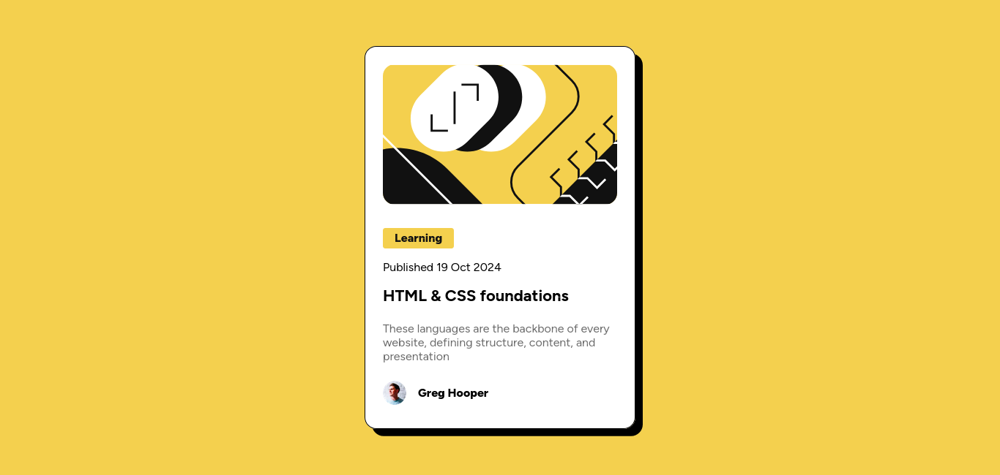

# Frontend Mentor - Blog preview card solution

This is a solution to the [Blog preview card challenge on Frontend Mentor](https://www.frontendmentor.io/challenges/blog-preview-card-ckPaj01IcS). Frontend Mentor challenges help you improve your coding skills by building realistic projects.

## Table of contents

- [Overview](#overview)
  - [The challenge](#the-challenge)
  - [Screenshot](#screenshot)
  - [Links](#links)
- [My process](#my-process)
  - [Built with](#built-with)
  - [What I learned](#what-i-learned)
  - [Useful resources](#useful-resources)
- [Author](#author)

## Overview

### The challenge

Users should be able to:

- See hover and focus states for all interactive elements on the page

### Screenshot



### Links

- Solution URL: [https://www.frontendmentor.io/solutions/blog-card-with-flexbox-BILQFbSE_g](https://www.frontendmentor.io/solutions/blog-card-with-flexbox-BILQFbSE_g)
- Live Site URL: [https://blog-card-prev.netlify.app/](https://blog-card-prev.netlify.app/)

## My process

### Built with

- Flexbox
- [React](https://reactjs.org/) - JS library
- [Vite](https://vite.dev) - Next Generation Frontend Tooling

### What I learned

This CSS snippet helped making the card so much more responsive

```css
#root {
  display: flex;
  justify-content: center;
  align-items: center;
  flex-shrink: 1;
  height: 100vh;

  * {
    min-width: 0;
  }
}
```

### Useful resources

- [Flex Item Size](https://stackoverflow.com/questions/36247140/why-dont-flex-items-shrink-past-content-size) - Helped me a lot for learning how to resize flex items.

## Author

- Frontend Mentor - [@Bruno514](https://www.frontendmentor.io/profile/Bruno514)
